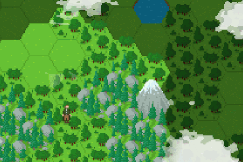

# Elmcrest

Elmcrest is the working title of a turn-based, adventure/role-playing game where
the player explores a procedurally generated world.

The game is built with HTML5 and lots of JavaScript.

**This is still a very early development feature demo. 
This version lacks content and therefore is not really playable by now.**

This repo does not necessarily represent the current state of development. 
Progress may be updated from time to time.

If you want to contribute or have any questions reach out to me [@coldi](https://twitter.com/coldi).

## 💯 Features

- Procedurally generated game world with different biomes
- [Hexagonal grid system](./src/modules/hex)
- [Pathfinding](./src/modules/pathfinder)
- Turn-based action point system
- WebGL weather effects with day/night cycle
- [Event system](./src/modules/events) with text-based dialogs and multiple choices
- [Inventory](./src/modules/inventories) and equipment system
- [Affix-based item generation](./src/modules/items) with different quality levels
- Management of multiple group characters
- Experience and level system
- Skill tree and skill progression
- Turn-based [combat system](./src/modules/combat)
- Basic survival mechanics with water/food/energy consumption
- NPCs that move around randomly
- Game configuration and scripts at runtime enable user-generated content
- Save/load game state
- Localization

## 🕹 Run / build the game

Install dependencies with `yarn install`.

Start the development mode with `yarn run start`.

Make a build with `yarn run build`. 
To run the production build in your browser, you need something like `http-server ./build`.

**Use latest Chrome browser!**

## 📚 Used libraries

- Redux for state management and game logic
- React for game UI
- Pixi.js for rendering of game world
- RxJS for action-based subscriptions between game modules

### Why?

This thing started out as a learning project for Redux, but grew into something bigger
after a couple of months. One reason is, that using Redux and React for a game like this
is pretty fun in my opinion. Another reason is, that even after a year of working on it
as a side project, it stayed quite maintainable and most things just worked out as
intended. 
However, **world performance is an issue** I have yet to figure out how to do it right/fast.
It just works in the first place! 😅

## 📂 Project structure

### `/assets`

Contains all types of game contents:
- Configurations (e.g. field types, skill parameters, item qualities, ...)
- Scripts (e.g. events, skills, locales, ...)
- Textures

### `/modules`

Contains the core game logic, bundled by features. 
More information on module structure can be found in [modules/README.md](./src/modules).

### `/scripts` (deprecated)

### `/setup`

Contains the setup scripts that load configuration files from `assets/` and
transform them into the game state.

### `/styles`

Contains global SCSS mixins, variables and styling for the UI.

### `/views`

Contains the game UI. This is React components land.

## 🙌 Acknowledgments

Hexagonal tileset by [CuddlyColin](https://cuddlycolin.itch.io/fantasy-hex-tiles)
